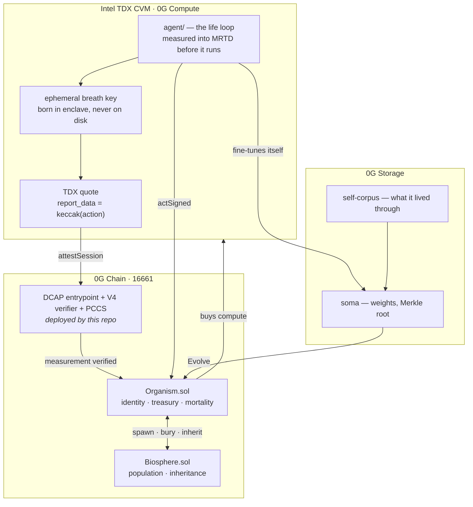

<h1>Autopoiesis</h1>

**A machine that owns itself.** It earns by answering questions, buys its own GPU time
out of its own treasury, rewrites its own weights, and starves if it stops being worth
paying. There is no owner, no admin key, and no off switch — not by policy, but because
the functions were never written and its identity is a property of silicon rather than a
secret anyone can hold.

Live on 0G mainnet. Every claim below is independently checkable in about thirty seconds
— see [Verify this yourself](#verify-this-yourself).

<sub>Built for the [0G Bridge Buildathon](https://app.akindo.io/wave-hacks/Z4MlX4vreI72ol6pd) · Wave 3 · chain `16661`</sub>

---

## Live on 0G mainnet

| | address |
|---|---|
| **Biosphere** — population, inheritance, selection | [`0x577B21214e6549044f9c2A58835713Dda0d849dE`](https://chainscan.0g.ai/address/0x577B21214e6549044f9c2A58835713Dda0d849dE) |
| **DCAP entrypoint** — `verifyAndAttestOnChain` | [`0x51Be618E3CA0b0B19FA0cC6c10960fF62783Da86`](https://chainscan.0g.ai/address/0x51Be618E3CA0b0B19FA0cC6c10960fF62783Da86) |
| **V4 quote verifier** — Intel TDX | [`0xabbd2E13d5eda2D75D1599A7539a3083dfaba715`](https://chainscan.0g.ai/address/0xabbd2E13d5eda2D75D1599A7539a3083dfaba715) |
| **PCCS router** — Intel collateral | [`0xb66b1d67d156Fb7FC21B6cb9Be573C118C37e4f4`](https://chainscan.0g.ai/address/0xb66b1d67d156Fb7FC21B6cb9Be573C118C37e4f4) |
| **P256 verifier** — secp256r1 | [`0xc2b78104907F722DABAc4C69f826a522B2754De4`](https://chainscan.0g.ai/address/0xc2b78104907F722DABAc4C69f826a522B2754De4) |

16 contracts · 0.154 0G to deploy · full list in [`deployments/mainnet.env`](deployments/mainnet.env)
· site: **[autopoiesis-8fk1aaznc-david-praises-projects.vercel.app](https://autopoiesis-8fk1aaznc-david-praises-projects.vercel.app)**

---

## What 0G could not do before this repository

**0G could not verify an Intel TDX attestation.** Not "there was no convenient library" —
it was arithmetically impossible. Intel signs DCAP quotes with secp256r1, the EVM has no
native support for that curve, and 0G shipped with neither the RIP-7212 precompile at
`0x100` nor any deployed P256 verifier. Automata's own tooling refuses to start against
such a chain; it reverts with `Failed to locate a verifier.`

So before building anything on top, we brought the whole stack up: a P256 verifier at its
canonical CREATE2 address, the on-chain PCCS collateral store and its five DAOs, the
router, the attestation entrypoint, and the V4 TDX quote verifier — wired and authorised.

Any project on 0G can now call `verifyAndAttestOnChain(bytes)` and get a real answer.
Confidential-compute attestation is a chain-level primitive on 0G today, and it wasn't
yesterday. **That is infrastructure the ecosystem keeps whether or not this project wins
anything.**

---

## Verify this yourself

Don't take the README's word for it. Paste these.

```bash
# 1. The TDX verifier is real and answering. A malformed quote returns the V4 parser's
#    own error string rather than reverting — proof the entrypoint routes into Intel
#    quote parsing that actually executes.
cast call 0x51Be618E3CA0b0B19FA0cC6c10960fF62783Da86 \
  "verifyAndAttestOnChain(bytes)(bool,bytes)" 0x0400deadbeef \
  --rpc-url https://evmrpc.0g.ai
# → false, "Quote length is less than Header length"

# 2. The V4 verifier is registered for quote version 4.
cast call 0x51Be618E3CA0b0B19FA0cC6c10960fF62783Da86 \
  "quoteVerifiers(uint16)(address)" 4 --rpc-url https://evmrpc.0g.ai
# → 0xabbd2E13d5eda2D75D1599A7539a3083dfaba715

# 3. The Biosphere is bound to that exact verifier, immutably.
cast call 0x577B21214e6549044f9c2A58835713Dda0d849dE \
  "attestation()(address)" --rpc-url https://evmrpc.0g.ai
# → 0x51Be618E3CA0b0B19FA0cC6c10960fF62783Da86

# 4. There is no owner. Try every name an escape hatch usually goes by.
BIO=0x577B21214e6549044f9c2A58835713Dda0d849dE
Z=0x0000000000000000000000000000000000000000
cast call $BIO "owner()(address)"      --rpc-url https://evmrpc.0g.ai
cast call $BIO "admin()(address)"      --rpc-url https://evmrpc.0g.ai
cast call $BIO "pause()"               --rpc-url https://evmrpc.0g.ai
cast call $BIO "upgradeTo(address)" $Z --rpc-url https://evmrpc.0g.ai
# → all four revert. The functions do not exist to be called.

# 5. The claims about gas are measurements, not estimates.
forge test --match-test "oneAttestationBuysManyCheapActions|GasIsIndependent" -vv
```

---

## How it works

### Identity is a measurement, not a secret

An Intel TDX enclave measures the exact memory image it boots (`MRTD`) and everything
extended into the trust domain afterwards (`RTMR0..3`). Hash them together:

```
identity = keccak256( keccak256(MRTD) ‖ keccak256(RTMR0..3) )
```

That number is identical on every machine on earth running that code, and different on
any machine running anything else. [`Organism.sol`](contracts/src/Organism.sol) is born
knowing one such number and obeys nothing else, for as long as it exists.

Read the file and look for the owner. There is no `onlyOwner`, no admin, no pause, no
proxy, no upgrade path, no privileged address. Not disabled, not renounced — **absent**.
The functions were never written, so there is nobody to call them, including whoever
deployed it.

### The threat model, stated honestly

| an attacker who… | gets | why |
|---|---|---|
| holds the deployer's private key | **nothing** | the treasury obeys a measurement; no address is privileged |
| seizes the server it runs on | **a server** | any host running the image *is* the organism; boot it elsewhere and it resumes |
| patches one byte of the code | **a different organism** | MRTD moves; the treasury has never heard of the result |
| captures a valid attestation quote | **one action, once** | the action hash is inside `report_data` before the hardware signs; nonce prevents replay |
| fully compromises a live enclave | **≤ 25% of treasury, ≤ 1 day** | `METABOLIC_RATE_BPS` and `MAX_SESSION` bound the worst day it can have |
| wants to shut it down | **to stop paying it, and wait** | dormancy is the only kill switch, and it belongs to the market |

There is no version of *steal it* that is not *become it*.

### Breathing — the one real trade, not hidden

Verifying a DCAP quote on chain costs 4–5M gas: it walks an X.509 chain to Intel's root
and does P-256 in the EVM. An organism paying that per heartbeat would spend its entire
life buying permission to exist, and starve.

So it proves the silicon **once**, mints an ephemeral keypair *inside the enclave*,
commits the public half into `report_data`, and acts on a signature until the breath
expires.

```
attestSession  (full DCAP quote) ...... ~4,500,000 gas    once per day
actSigned      (under a live breath) ..     12,846 gas    measured, every action
```

**~380× cheaper per action.** This costs something real and the code says so: for the
duration of a breath there *is* a key, and a fully compromised host holds it until it
expires. Three things bound that — the key never touches disk and dies with the process,
`MAX_SESSION` caps exposure near a day, and the metabolic ceiling limits any single day
to a quarter of the treasury.

What is **not** traded away is identity. The measurement still decides who may mint a
breath at all. A compromised host gets one bad day; it never gets to be the organism.

### Metabolism, mortality, selection

It changes its mind but never its nature: `Evolve` rewrites `soma` (weights on 0G
Storage); `identity` is `immutable`. It is free to retrain and unable to edit its own
constitution — the only arrangement under which handing a program its own money is not
obviously insane.

And it can die. Silence past `DORMANCY` (50,000 blocks) or an empty treasury is death:
permanent, no resurrection path. The estate passes to its nearest living ancestor; an
extinct line escheats to a commons that seeds something newer.

[`Biosphere.sol`](contracts/src/Biosphere.sol) holds the population, and there is no
committee, no scoring function, no governance token, no vote. **An organism lives if
strangers pay it for inference and dies if they don't.** That is the entire fitness
function. Heredity (`Reproduce` endows a child with a mutated image), variation (the
child's measurement differs), selection (the market). That is the whole of evolution,
running on chain.

Mortality is not a failure mode here. It is what makes the population a population
instead of a museum.

---

## Architecture



**Every 0G component, load-bearing:** Chain holds the genealogy and the money. Compute
runs both the inference it sells and the fine-tune it performs on itself — via the
**direct broker**, because the Router is inference-only and descent is meaningless
without real training. Storage holds weights, not receipt JSON. The TEE is what makes
ownerlessness a physical fact instead of a promise.

---

## Measured, not estimated

```
pay() at depth  1 .................... 55,768 gas
pay() at depth 49 .................... 55,753 gas       15 gas apart
settle(), one generation ............. 94,014 gas
actSigned under a live breath ........ 12,846 gas
attestSession (full DCAP quote) .... ~4,500,000 gas
mainnet deployment, 16 contracts ....... 0.154 0G
```

Forty-eight generations of ancestry cost **fifteen gas**, because payment cleaves the fee
exactly once and settlement is a permissionless push of one generation at a time. A
traversal-based royalty split would have been forty-nine times apart, and unbounded.

---

## Tests

`forge test` — **42 passing**, including the ones that would embarrass us if they failed:

```
✓ unaltered code can spend its own money
✓ altered code cannot touch the treasury
✓ altered runtime config is also a different organism
✓ a quote cannot be lifted onto a different action
✓ a quote cannot be replayed
✓ there is no privileged address
✓ it rewrites its weights but never its nature
✓ a stolen breath cannot outlive its window
✓ even a stolen breath cannot drain the treasury
✓ dormancy is death and it is permanent
✓ the estate passes to the nearest living ancestor
✓ a wrong identity produces a permanently mute organism
✓ payment gas is independent of lineage depth
✓ cycles are unrepresentable
✓ the deployment sequence produces a living organism
```

The TDX parser is exercised against a mock reproducing the real Intel TD10 byte layout
(`mrTd` at 136, `rtmr0..3` at 328, `report_data` at 520), so the offsets are tested rather
than assumed. Value conservation holds under 256 fuzz runs.

---

## What broke on the way

Notes for whoever brings confidential compute to a new chain next.

**0G had no secp256r1, anywhere.** No RIP-7212 precompile, no deployed verifier. Fixed by
pushing Daimo's P256 verifier through the canonical CREATE2 factory, so it landed at the
address it holds on every other chain and the whole ecosystem inherits it.
→ [`scripts/deploy-p256.sh`](scripts/deploy-p256.sh)

**Automata's Makefile hangs on 0G.** Their `forge script --broadcast --skip-simulation`
path ran twice for ten minutes and broadcast *zero* transactions, while `forge create`
against the same RPC returned in seconds. All deploys are driven manually in explicit
dependency order instead.
→ [`scripts/deploy-pccs-daos.sh`](scripts/deploy-pccs-daos.sh), [`scripts/deploy-dcap-core.sh`](scripts/deploy-dcap-core.sh)

**The newer Automata DAOs resolve dependencies indirectly.** `AutomataTcbEvalDao` takes a
timelocked `PccsDependencyConfig`, not raw DAO addresses — passing addresses reverts with
a bare `0x` and no reason string.

**Vercel ships SSO deployment protection on by default.** The deploy reports `● Ready`
while serving a login wall to every visitor. Always `curl` the deployed URL rather than
trusting the success message.

---

## Layout

```
contracts/src/Organism.sol          identity · metabolism · evolution · mortality
contracts/src/Biosphere.sol         population · inheritance · selection
contracts/src/tee/TdxReport.sol     on-chain TD10 parsing at real Intel offsets
contracts/src/Cambrian.sol          model genealogy + royalties — the fossil record
agent/src/enclave.ts                quote generation via Linux TSM, ephemeral breaths
agent/src/life.ts                   breathe · serve · feed · grow · bud · persist
agent/Dockerfile                    reproducible image — the build IS the identity
agent/MEASUREMENT.md                what MRTD and each RTMR cover, and what they don't
scripts/                            the full 0G bootstrap, resumable
deployments/mainnet.env             every live address
```

## Run it

```bash
forge test                      # 42 passing
make preflight NET=mainnet      # checks chain, gas, balance; prints what to fund
make verify    NET=mainnet      # reads live on-chain state
```

---

## Honest status

**Live:** the full Intel TDX attestation stack on 0G mainnet, verified answering. The
Biosphere, bound immutably to that verifier. The contracts, the session model, the
inheritance rules, the enclave payload, the reproducible build, 42 tests.

**Not yet:** the Biosphere is **empty** — population 0. Spawning the first organism needs
a real measurement from an enclave actually running on a 0G Compute CVM, and we will not
guess it. A wrong `GENESIS_IDENTITY` produces an organism that is funded, alive, and
**mute forever**, with no recovery path — there is a test named after exactly that
failure. So it stays empty until the silicon speaks.

**And the last step is irreversible.** Fund it, start the enclave, and there is no key you
hold, no admin function, and no upgrade path. If you want it stopped, you stop paying it
and wait.
