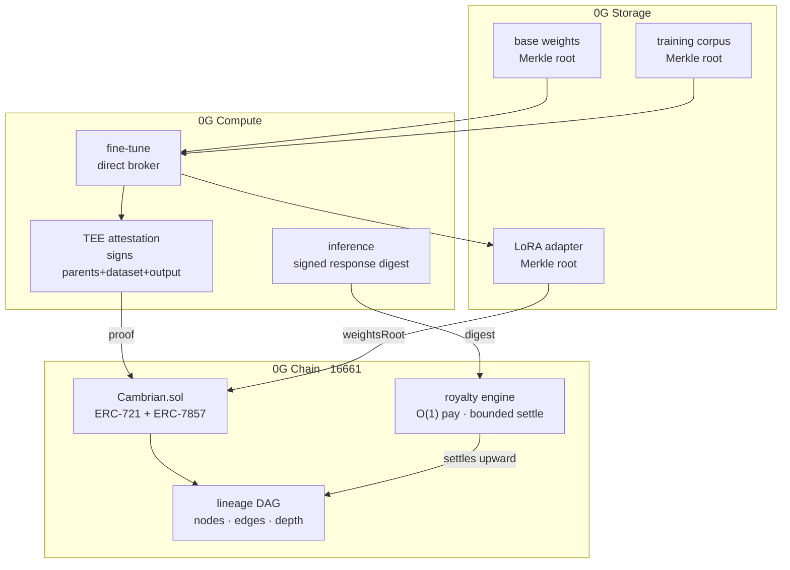

# Cambrian

**A genealogy of neural networks. Every model is a node; every inference pays its ancestry.**

Built for the [0G Bridge Buildathon](https://app.akindo.io/wave-hacks/Z4MlX4vreI72ol6pd) — Wave 3.

---

## The idea

Open-weight AI has lineage but no memory of it. A model is fine-tuned from a base, merged with
another, distilled, fine-tuned again — and by the fourth generation nobody can prove what it
descended from, and nobody upstream sees a cent.

Cambrian makes descent a first-class on-chain object:

- **Weights** live on 0G Storage, addressed by Merkle root.
- **A fine-tune** stores only its LoRA adapter — the *delta*, not a new copy of the model.
- **Descent** is a DAG on 0G Chain. Forks, merges, depth, provenance.
- **Every inference paid to any node settles value upward through its entire ancestry**, forever,
  with no coordination and no one's permission.

A model is not a file. It is a descendant.

---

## The hard part

Paying an ancestry must not mean walking one.

The obvious implementation splits a fee across every ancestor at payment time. It is also the
implementation that dies: gas grows with lineage depth, so the thirtieth generation of a model
becomes unaffordable to query and the graph stops growing exactly where it gets interesting.

Cambrian splits the problem instead:

| | cost | who pays |
|---|---|---|
| `pay()` | **O(1)** — the fee cleaves once into *kept* and *owed* | the inference buyer |
| `settle()` | **O(parents)**, capped at 8 — pushes debt up one generation | whoever wants the money |

Settlement is permissionless. An ancestor that wants its revenue pays the gas to pull value toward
itself; nobody subsidises anybody. Value in transit is already owed to a determined set of nodes,
so settlement only converts it to claimable form — it never creates or destroys it.

### Measured

```
pay() at depth  1 ........ 55,768 gas
pay() at depth 49 ........ 55,753 gas
difference ...............     15 gas
settle(), one generation .. 94,014 gas
```

Forty-eight generations of ancestry cost **fifteen gas**. A traversal-based split would have been
forty-nine times apart.

### Invariants held

- `Σ earned + Σ upstream == address(this).balance` — verified under 256 fuzz runs
- No wei is lost to rounding; the last parent absorbs every division remainder
- **Cycles are unrepresentable**, not merely rejected: ids increase monotonically and a node may
  only name parents that already exist, so every edge points backwards in time
- A derivative can never route 100% of its revenue upward (`MAX_INHERIT_BPS = 9000`), so a node
  cannot be minted purely to drain a lineage

---

## Architecture



### Why this needs 0G specifically

| component | how Cambrian uses it | why it could not be elsewhere |
|---|---|---|
| **0G Storage** | model weights and LoRA adapters, Merkle-addressed, 4GB+ fragmented uploads | content-addressing dedupes identical adapters automatically; no other chain hosts weights at this scale or price |
| **0G Compute** | the **direct broker**, for *fine-tuning* — not the inference-only Router | descent is only meaningful if training actually happened; the TEE signature is what makes it checkable |
| **ERC-7857** | `clone()` reinterpreted as licensing — a clone is a child node that pays its origin | the standard exists to move intelligence with its metadata intact; Cambrian gives that economic teeth |
| **0G Chain** | the genealogy, balances, settlement | per-inference royalty accounting is only affordable at 0G gas prices |
| **0G Pay / DA** | settlement rails and high-throughput inference receipts | *(roadmap — Wave 4)* |

---

## Layout

```
contracts/src/Cambrian.sol              the protocol — DAG, royalties, ERC-7857
contracts/src/IAttestationVerifier.sol  TEE training-provenance interface
contracts/test/Cambrian.t.sol           15 tests incl. gas + conservation fuzzing
contracts/script/Deploy.s.sol           0G mainnet deployment
packages/sdk/src/weights.ts             0G Storage — adapter upload, reconstruction order
packages/sdk/src/compute.ts             0G Compute — fine-tuning + attested inference
packages/sdk/src/lineage.ts             DAG reader + exact off-chain split preview
web/index.html                          the living lineage demo
```

---

## Run it

```bash
forge install
forge test -vv                 # 15 passing, incl. the gas-independence proof
forge script contracts/script/Deploy.s.sol --rpc-url og_mainnet --broadcast
```

Requires `PRIVATE_KEY` in the environment. 0G mainnet: chain `16661`,
RPC `https://evmrpc.0g.ai`, explorer `https://chainscan.0g.ai`.

---

## Status

- [x] Protocol core — lineage DAG, O(1) payment, bounded settlement, ERC-7857 surface
- [x] Test suite — 15 tests, gas bounds proven, value conservation fuzzed
- [x] 0G Storage / Compute integration layer
- [x] Living lineage demo
- [ ] Mainnet deployment + explorer link *(needs a funded key)*
- [ ] TEE attestation verifier — moves attestation from recorded to enforced
- [ ] Adapter composition service: reconstruct any node's weights from its lineage
